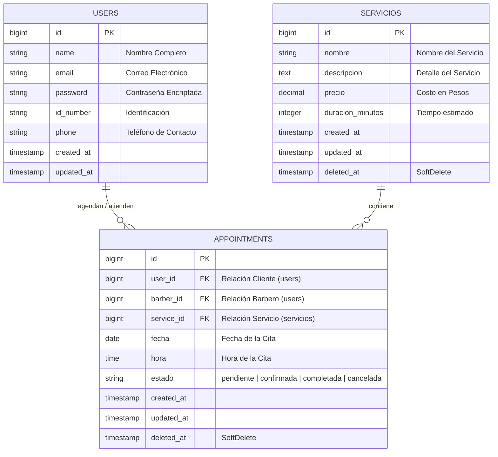

# ✂️ Olan BarberShop - Sistema de Gestión de Citas y Automatizaciones 💈

Bienvenido a **Olan BarberShop**, una plataforma moderna y robusta para la gestión y reservación de citas en línea desarrollada en **Laravel 11, Livewire y Alpine.js**. 

Este sistema ha sido diseñado desde cero incorporando directrices profesionales de arquitectura de software y las nuevas **reglas de automatización proactiva** que demuestran la interacción automatizada del software con el usuario mediante la generación de documentos físicos, notificaciones en tiempo real y tareas programadas en segundo plano.

---

## Diagrama Entidad-Relación (DER) de Base de Datos

A continuación se muestra la estructura y relaciones de las tablas principales de la base de datos MySQL de la aplicación, modeladas de manera limpia y profesional:



---

## Características y Automatizaciones Implementadas

### 1. Borrado Lógico de Citas (`SoftDeletes`)
Para garantizar la integridad y auditoría de la información de la barbería, las citas nunca se eliminan físicamente de la base de datos.
* **Implementación:** Activado el trait `SoftDeletes` en el modelo `Appointment` y migración física en MySQL.
* **Beneficio:** Las citas borradas se ocultan automáticamente de las listas del panel de control de forma transparente, pero se mantienen disponibles en la base de datos para análisis históricos.

### 2. Generador de Tickets en PDF Físicos
Permite a los administradores y clientes descargar un comprobante de cita físico optimizado para impresión térmica.
* **Implementación:** Integrado `barryvdh/laravel-dompdf` con diseño prémium personalizado en tamaño de ticket de compra (`[0, 0, 480, 720]` puntos) e iniciales `OB-` de folio.
* **Seguridad:** Middleware y Gated checks estrictos que impiden a un cliente descargar los comprobantes de otros clientes.

### 3. Notificación Proactiva por Correo Real (Gmail SMTP) con Ticket PDF Adjunto
Cada vez que un cliente o administrador agenda una nueva cita, el sistema despacha automáticamente un correo electrónico responsivo con diseño de alta calidad (tonos dorado y negro), **adjuntando de forma automática el Ticket de Cita en formato PDF**.
* **Implementación:** Escucha autónoma del evento Eloquent `created` directamente en la fase de booteo de `Appointment`.
* **Proceso en Memoria (In-Memory):** El PDF se compila y se adjunta directamente al correo electrónico (`ticket_cita_OB-XXXXX.pdf`) utilizando la función `Attachment::fromData()`, **sin escribir un solo archivo temporal en el disco duro**, garantizando la máxima velocidad y optimización del almacenamiento del servidor.
* **Resiliencia:** Incorpora un sistema de logs en `storage/logs/laravel.log` para capturar cualquier error de red sin interrumpir la experiencia de navegación del usuario.

### 4. Tarea Programada de Recordatorio Diario (`Task Scheduling`)
Para evitar inasistencias en la barbería, el sistema cuenta con una tarea en segundo plano que corre diariamente para recordar a los clientes su cita del día siguiente.
* **Implementación:** Programación directa en `routes/console.php` a través de `Schedule::call` y biblioteca de fechas `Carbon`.
* **Comando de Simulación para Evaluación:** `php artisan schedule:run` (ejecuta y envía recordatorios al instante de las citas programadas para el día de mañana).

---

## 🛠️ Requisitos e Instalación

Para ejecutar este proyecto en tu entorno de desarrollo local, sigue estos pasos:

### 1. Clonar el proyecto e instalar dependencias
```bash
composer install
npm install
```

### 2. Configurar las variables de entorno
1. Duplica el archivo `.env.example` y nómbralo `.env`.
2. Configura tu base de datos MySQL local:
   ```env
   DB_CONNECTION=mysql
   DB_HOST=127.0.0.1
   DB_PORT=3306
   DB_DATABASE=olan_barber
   DB_USERNAME=tu_usuario
   DB_PASSWORD=tu_contrasena
   ```
3. Configura tus credenciales reales de Gmail SMTP para probar los correos:
   ```env
   MAIL_MAILER=smtp
   MAIL_HOST=smtp.gmail.com
   MAIL_PORT=587
   MAIL_USERNAME=tu_correo_gmail@gmail.com
   MAIL_PASSWORD=tu_contrasena_de_16_caracteres_de_google
   MAIL_FROM_ADDRESS="tu_correo_gmail@gmail.com"
   MAIL_FROM_NAME="Olan BarberShop"
   ```

### 3. Correr las migraciones y seeders
Genera las tablas limpias de base de datos, los roles de usuario (Cliente, Barbero, Administrador) y los servicios de barbería por defecto:
```bash
php artisan migrate --seed
```

### 4. Compilar assets y arrancar servidores
Abre dos terminales y ejecuta de forma paralela:
```bash
# Terminal 1: Servidor web PHP
php artisan serve

# Terminal 2: Compilador de estilos Vite/Tailwind
npm run dev
```

---

## Cuentas de Acceso para Pruebas (Evaluadores)

Para facilitar la evaluación de roles y permisos del sistema, los seeders configuran las siguientes cuentas por defecto con la contraseña `12345678`:

| Rol | Correo de Acceso | Contraseña |
| :--- | :--- | :--- |
| **Administrador** | `test@test.com` o `sharispech@gmail.com` | `12345678` |
| **Cliente de Prueba** | `cliente@test.com` | `12345678` |
| **Barbero de Prueba** | `barber@test.com` | `12345678` |

---
**Desarrollado con ❤️ para Olan BarberShop - Proyecto de Automatizaciones Avanzadas.**
